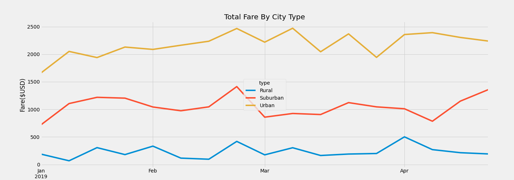

# PyBer_Analysis

## Overview of the analysis:
V. Isualize has given us a brand-new assignment. Using Pandas and Matplotlib, we've greate a multiple-line graph that shows the total weekly fares for each city type. 

## Results:

## Summary:
- Urban areas have the highest income fare rate, where the average fare rate per ride is lower than the other areas. 
  
- Rural as well as the least amount of drivers, as well as a higher rare rate per ride.
  
- If average fare was reduced and more drivers increased the total fares could increase in value. 

